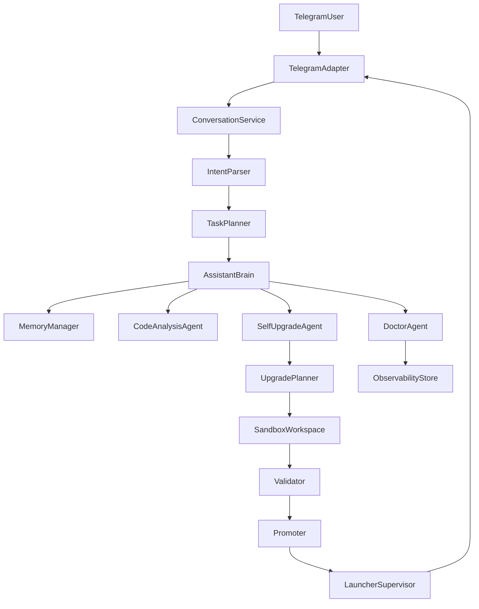

# KonstanceAI Repair And Evolution Roadmap

## Current State

KonstanceAI already has a usable base in `[C:/Users/Thinkpad/Desktop/KonstanceAI/launcher.py](C:/Users/Thinkpad/Desktop/KonstanceAI/launcher.py)`, `[C:/Users/Thinkpad/Desktop/KonstanceAI/bot.py](C:/Users/Thinkpad/Desktop/KonstanceAI/bot.py)`, and `[C:/Users/Thinkpad/Desktop/KonstanceAI/scripts/modules/](C:/Users/Thinkpad/Desktop/KonstanceAI/scripts/modules/)`, but the live system is unstable because the active Telegram path and the autonomous-edit path do not share a consistent API.

Key confirmed defects:

- `bot.py` calls `smart_reply(text, prefs, profile, history, self_context=...)`, but `[smart_reply_engine.py](C:/Users/Thinkpad/Desktop/KonstanceAI/scripts/modules/smart_reply_engine.py)` only defines a 3-argument `smart_reply(...)`.
- `[intent_router.py](C:/Users/Thinkpad/Desktop/KonstanceAI/scripts/modules/intent_router.py)`, `[autonomous_loop.py](C:/Users/Thinkpad/Desktop/KonstanceAI/scripts/modules/autonomous_loop.py)`, and `[goal_engine.py](C:/Users/Thinkpad/Desktop/KonstanceAI/scripts/modules/goal_engine.py)` import `_try_ollama` and `_try_openclaw`, but those helpers do not exist in the live `smart_reply_engine.py`.
- The so-called OpenClaw editing layer is unsafe: `[tools/openclaw_manager.py](C:/Users/Thinkpad/Desktop/KonstanceAI/tools/openclaw_manager.py)` and `[tools/file_tools.py](C:/Users/Thinkpad/Desktop/KonstanceAI/tools/file_tools.py)` perform blind writes with no sandbox, diffing, policy, or validation.
- The repo has multiple competing architectures: active runtime in `launcher.py`/`bot.py`, legacy runtime in `[interface/telegram_bot.py](C:/Users/Thinkpad/Desktop/KonstanceAI/interface/telegram_bot.py)`, malformed legacy agents in `[agents/coding_agent.py](C:/Users/Thinkpad/Desktop/KonstanceAI/agents/coding_agent.py)`, and hardcoded path-based side systems such as `[scripts/modules/autonomy_dispatcher.py](C:/Users/Thinkpad/Desktop/KonstanceAI/scripts/modules/autonomy_dispatcher.py)`.
- Startup and observability are inconsistent: launcher docs promise logs, but some sidecars write to files that are not created first; `data/cloud_status.json` shows the configured relay currently fails with `HTTP Error 404: Not Found`.
- Environment reproducibility is weak: only `[requirements.txt](C:/Users/Thinkpad/Desktop/KonstanceAI/requirements.txt)` exists, a checked-in `.venv` is present, but launchers still use bare `python`/`pip` instead of the venv interpreter.

Mission alignment from `[data/mission.json](C:/Users/Thinkpad/Desktop/KonstanceAI/data/mission.json)`: the current code supports Telegram chat, basic self-inspection, low-level draft/apply/rollback, and simple background jobs, but it does not yet support safe autonomous upgrades, sandbox validation, coherent Telegram-only control, or self-healing operations.

## Target Architecture

Use one canonical runtime and split transport from cognition and execution.




Proposed module layout under `KonstanceAI/`:

- `core/`
  - application wiring, config loading, service registry, structured result types.
- `telegram/`
  - Telegram adapter only: handlers, message normalization, response rendering, auth checks.
- `ai_brain/`
  - `intent_parser.py`, `task_planner.py`, `assistant_service.py`, `code_analysis_agent.py`, `self_upgrade_agent.py`, `doctor_agent.py`, `memory_manager.py`.
- `self_edit/`
  - deterministic file access, diff application, file policy, backup manager.
- `upgrade_system/`
  - `planner.py`, `sandbox.py`, `validator.py`, `promoter.py`, `rollback.py`.
- `doctor/`
  - crash analysis, log inspection, health repair suggestions, loop suppression.
- `memory/`
  - conversation memory, mission state, approval state, change ledger.
- `launcher/`
  - `start_konstance.ps1`, `preflight.py`, `service_manager.py`.

Architectural rules:

- `bot.py` becomes a thin compatibility shell or is replaced by `telegram/app.py`.
- Only one LLM gateway module exposes model access to the rest of the system.
- Only one file-mutation gateway exists, and it never edits the live runtime directly.
- Every autonomous change goes through `upgrade_system/sandbox.py` and `upgrade_system/validator.py` before promotion.
- Telegram is the primary control plane for chat, status, approvals, upgrades, and doctor actions.

## Step-By-Step Implementation Roadmap

1. Stabilize the current runtime before any migration.

- Keep `launcher.py` as the temporary canonical entrypoint.
- Fix the `smart_reply` signature mismatch and the missing `_try_ollama` / `_try_openclaw` contract in `smart_reply_engine.py`.
- Ensure `logs/` creation happens before every sidecar writes.
- Fail fast when `OWNER_ID` is missing instead of silently degrading privileged Telegram flows.
- Remove hardcoded root paths from runtime helpers.

1. Collapse duplicate and dangerous execution paths.

- Deprecate or remove the legacy Telegram stack in `interface/telegram_bot.py` and the malformed legacy agents in `agents/` from production startup.
- Mark `main.py` as unsupported for runtime and ensure installers and shortcuts never target it.
- Replace raw write helpers in `tools/file_tools.py`, `tools/openclaw_manager.py`, and `tools/system_tools.py` with thin wrappers around the new governed services or retire them.

1. Introduce a transport-agnostic application core.

- Add `core/config.py`, `core/state.py`, and `core/contracts.py` for config, runtime state, and normalized action results.
- Add a single message entrypoint like `handle_user_message(user_id, text, channel="telegram")` that returns a structured result.
- Move owner checks, approval resolution, and session memory out of Telegram handlers.

1. Build the AI cognitive layer.

- Create `ai_brain/intent_parser.py` for natural-language intent and entity extraction.
- Create `ai_brain/task_planner.py` for deciding between chat, status, doctor, or upgrade workflows.
- Create `ai_brain/code_analysis_agent.py` for repo inspection and architecture reasoning.
- Create `ai_brain/self_upgrade_agent.py` to translate approved improvement requests into upgrade plans.
- Create `ai_brain/doctor_agent.py` for crash diagnosis, repair proposals, and safe recovery.
- Create `ai_brain/memory_manager.py` for short-term context, mission notes, and change memory.

1. Build the safe self-upgrade pipeline.

- Create `upgrade_system/planner.py` to turn requested changes into explicit upgrade plans.
- Create `upgrade_system/sandbox.py` to clone or copy the repo into a temporary workspace.
- Create `upgrade_system/validator.py` to run syntax checks, import checks, unit tests, startup smoke tests, and Telegram health checks.
- Create `upgrade_system/promoter.py` to promote validated sandbox changes to live safely.
- Create `upgrade_system/rollback.py` for versioned rollback using snapshots and change ledgers.

1. Rebuild Telegram control around intent, not command strings.

- Add `telegram/adapter.py` and `telegram/handlers.py` so Telegram only parses transport details.
- Support natural intents such as status, show drafts, approve latest, reject latest, analyze system, run doctor, plan upgrade, and apply approved upgrade.
- Keep slash commands as explicit fallbacks, but ensure normal conversation is the primary UX.

1. Add doctor and observability systems.

- Create `doctor/monitor.py`, `doctor/analyzer.py`, and `doctor/recovery.py`.
- Centralize logs, health state, restart counts, validation results, and last known-good version.
- Detect crash loops and stop self-restarting after a threshold until a doctor workflow approves the next action.

1. Add the autonomous improvement loop.

- Create a scheduled analysis loop that rereads `ref.txt`, `data/mission.json`, health state, and recent logs.
- It should generate proposals only, not self-apply directly.
- Improvement proposals must still go through planner -> sandbox -> validator -> promote.

1. Finish packaging and desktop operations.

- Replace the current script sprawl with `launcher/start_konstance.ps1` and a simple desktop launcher.
- Preflight must verify venv, dependencies, `.env`, model endpoints, writable data directories, and lock state.
- Keep `launcher.py` only if it cleanly wraps the new service manager; otherwise replace it with `launcher/service_manager.py`.

## File Creation Plan

New files to create:

- `[C:/Users/Thinkpad/Desktop/KonstanceAI/core/config.py](C:/Users/Thinkpad/Desktop/KonstanceAI/core/config.py)`
- `[C:/Users/Thinkpad/Desktop/KonstanceAI/core/state.py](C:/Users/Thinkpad/Desktop/KonstanceAI/core/state.py)`
- `[C:/Users/Thinkpad/Desktop/KonstanceAI/core/contracts.py](C:/Users/Thinkpad/Desktop/KonstanceAI/core/contracts.py)`
- `[C:/Users/Thinkpad/Desktop/KonstanceAI/telegram/adapter.py](C:/Users/Thinkpad/Desktop/KonstanceAI/telegram/adapter.py)`
- `[C:/Users/Thinkpad/Desktop/KonstanceAI/telegram/handlers.py](C:/Users/Thinkpad/Desktop/KonstanceAI/telegram/handlers.py)`
- `[C:/Users/Thinkpad/Desktop/KonstanceAI/telegram/renderers.py](C:/Users/Thinkpad/Desktop/KonstanceAI/telegram/renderers.py)`
- `[C:/Users/Thinkpad/Desktop/KonstanceAI/ai_brain/intent_parser.py](C:/Users/Thinkpad/Desktop/KonstanceAI/ai_brain/intent_parser.py)`
- `[C:/Users/Thinkpad/Desktop/KonstanceAI/ai_brain/task_planner.py](C:/Users/Thinkpad/Desktop/KonstanceAI/ai_brain/task_planner.py)`
- `[C:/Users/Thinkpad/Desktop/KonstanceAI/ai_brain/assistant_service.py](C:/Users/Thinkpad/Desktop/KonstanceAI/ai_brain/assistant_service.py)`
- `[C:/Users/Thinkpad/Desktop/KonstanceAI/ai_brain/code_analysis_agent.py](C:/Users/Thinkpad/Desktop/KonstanceAI/ai_brain/code_analysis_agent.py)`
- `[C:/Users/Thinkpad/Desktop/KonstanceAI/ai_brain/self_upgrade_agent.py](C:/Users/Thinkpad/Desktop/KonstanceAI/ai_brain/self_upgrade_agent.py)`
- `[C:/Users/Thinkpad/Desktop/KonstanceAI/ai_brain/doctor_agent.py](C:/Users/Thinkpad/Desktop/KonstanceAI/ai_brain/doctor_agent.py)`
- `[C:/Users/Thinkpad/Desktop/KonstanceAI/ai_brain/memory_manager.py](C:/Users/Thinkpad/Desktop/KonstanceAI/ai_brain/memory_manager.py)`
- `[C:/Users/Thinkpad/Desktop/KonstanceAI/self_edit/file_policy.py](C:/Users/Thinkpad/Desktop/KonstanceAI/self_edit/file_policy.py)`
- `[C:/Users/Thinkpad/Desktop/KonstanceAI/self_edit/diff_engine.py](C:/Users/Thinkpad/Desktop/KonstanceAI/self_edit/draft_store.py)`
- `[C:/Users/Thinkpad/Desktop/KonstanceAI/self_edit/draft_store.py](C:/Users/Thinkpad/Desktop/KonstanceAI/self_edit/draft_store.py)`
- `[C:/Users/Thinkpad/Desktop/KonstanceAI/upgrade_system/planner.py](C:/Users/Thinkpad/Desktop/KonstanceAI/upgrade_system/planner.py)`
- `[C:/Users/Thinkpad/Desktop/KonstanceAI/upgrade_system/sandbox.py](C:/Users/Thinkpad/Desktop/KonstanceAI/upgrade_system/sandbox.py)`
- `[C:/Users/Thinkpad/Desktop/KonstanceAI/upgrade_system/validator.py](C:/Users/Thinkpad/Desktop/KonstanceAI/upgrade_system/validator.py)`
- `[C:/Users/Thinkpad/Desktop/KonstanceAI/upgrade_system/promoter.py](C:/Users/Thinkpad/Desktop/KonstanceAI/upgrade_system/promoter.py)`
- `[C:/Users/Thinkpad/Desktop/KonstanceAI/upgrade_system/rollback.py](C:/Users/Thinkpad/Desktop/KonstanceAI/upgrade_system/rollback.py)`
- `[C:/Users/Thinkpad/Desktop/KonstanceAI/doctor/monitor.py](C:/Users/Thinkpad/Desktop/KonstanceAI/doctor/monitor.py)`
- `[C:/Users/Thinkpad/Desktop/KonstanceAI/doctor/analyzer.py](C:/Users/Thinkpad/Desktop/KonstanceAI/doctor/analyzer.py)`
- `[C:/Users/Thinkpad/Desktop/KonstanceAI/doctor/recovery.py](C:/Users/Thinkpad/Desktop/KonstanceAI/doctor/recovery.py)`
- `[C:/Users/Thinkpad/Desktop/KonstanceAI/launcher/start_konstance.ps1](C:/Users/Thinkpad/Desktop/KonstanceAI/launcher/start_konstance.ps1)`
- `[C:/Users/Thinkpad/Desktop/KonstanceAI/launcher/preflight.py](C:/Users/Thinkpad/Desktop/KonstanceAI/launcher/preflight.py)`
- `[C:/Users/Thinkpad/Desktop/KonstanceAI/launcher/service_manager.py](C:/Users/Thinkpad/Desktop/KonstanceAI/launcher/service_manager.py)`
- `[C:/Users/Thinkpad/Desktop/KonstanceAI/tests/test_telegram_integration.py](C:/Users/Thinkpad/Desktop/KonstanceAI/tests/test_telegram_integration.py)`
- `[C:/Users/Thinkpad/Desktop/KonstanceAI/tests/test_upgrade_pipeline.py](C:/Users/Thinkpad/Desktop/KonstanceAI/tests/test_upgrade_pipeline.py)`
- `[C:/Users/Thinkpad/Desktop/KonstanceAI/tests/test_doctor_system.py](C:/Users/Thinkpad/Desktop/KonstanceAI/tests/test_doctor_system.py)`

Files to modify:

- `[C:/Users/Thinkpad/Desktop/KonstanceAI/launcher.py](C:/Users/Thinkpad/Desktop/KonstanceAI/launcher.py)`
- `[C:/Users/Thinkpad/Desktop/KonstanceAI/bot.py](C:/Users/Thinkpad/Desktop/KonstanceAI/bot.py)`
- `[C:/Users/Thinkpad/Desktop/KonstanceAI/scripts/modules/smart_reply_engine.py](C:/Users/Thinkpad/Desktop/KonstanceAI/scripts/modules/smart_reply_engine.py)`
- `[C:/Users/Thinkpad/Desktop/KonstanceAI/scripts/modules/self_model.py](C:/Users/Thinkpad/Desktop/KonstanceAI/scripts/modules/self_model.py)`
- `[C:/Users/Thinkpad/Desktop/KonstanceAI/scripts/modules/intent_router.py](C:/Users/Thinkpad/Desktop/KonstanceAI/scripts/modules/intent_router.py)`
- `[C:/Users/Thinkpad/Desktop/KonstanceAI/scripts/modules/autonomous_loop.py](C:/Users/Thinkpad/Desktop/KonstanceAI/scripts/modules/autonomous_loop.py)`
- `[C:/Users/Thinkpad/Desktop/KonstanceAI/scripts/modules/code_editor.py](C:/Users/Thinkpad/Desktop/KonstanceAI/scripts/modules/code_editor.py)`
- `[C:/Users/Thinkpad/Desktop/KonstanceAI/scripts/modules/goal_engine.py](C:/Users/Thinkpad/Desktop/KonstanceAI/scripts/modules/goal_engine.py)`
- `[C:/Users/Thinkpad/Desktop/KonstanceAI/scripts/start-all.ps1](C:/Users/Thinkpad/Desktop/KonstanceAI/scripts/start-all.ps1)`
- `[C:/Users/Thinkpad/Desktop/KonstanceAI/START_KONSTANCE.cmd](C:/Users/Thinkpad/Desktop/KonstanceAI/START_KONSTANCE.cmd)`
- `[C:/Users/Thinkpad/Desktop/KonstanceAI/02_verify_and_test.ps1](C:/Users/Thinkpad/Desktop/KonstanceAI/02_verify_and_test.ps1)`
- `[C:/Users/Thinkpad/Desktop/KonstanceAI/requirements.txt](C:/Users/Thinkpad/Desktop/KonstanceAI/requirements.txt)`

Files to retire, remove, or merge out of the runtime path:

- `[C:/Users/Thinkpad/Desktop/KonstanceAI/interface/telegram_bot.py](C:/Users/Thinkpad/Desktop/KonstanceAI/interface/telegram_bot.py)`
- `[C:/Users/Thinkpad/Desktop/KonstanceAI/main.py](C:/Users/Thinkpad/Desktop/KonstanceAI/main.py)`
- `[C:/Users/Thinkpad/Desktop/KonstanceAI/tools/file_tools.py](C:/Users/Thinkpad/Desktop/KonstanceAI/tools/file_tools.py)`
- `[C:/Users/Thinkpad/Desktop/KonstanceAI/tools/openclaw_manager.py](C:/Users/Thinkpad/Desktop/KonstanceAI/tools/openclaw_manager.py)`
- `[C:/Users/Thinkpad/Desktop/KonstanceAI/tools/system_tools.py](C:/Users/Thinkpad/Desktop/KonstanceAI/tools/system_tools.py)`
- malformed legacy agents in `[C:/Users/Thinkpad/Desktop/KonstanceAI/agents/](C:/Users/Thinkpad/Desktop/KonstanceAI/agents/)`
- hardcoded-path sidecars such as `[C:/Users/Thinkpad/Desktop/KonstanceAI/scripts/modules/autonomy_dispatcher.py](C:/Users/Thinkpad/Desktop/KonstanceAI/scripts/modules/autonomy_dispatcher.py)` unless rewritten to use the new upgrade system.

## Dependency And Service Plan

Required Python libraries:

- `python-telegram-bot`
- `python-dotenv`
- `requests`
- `pydantic` for validated config and result models
- `watchdog` for file/log monitoring if lightweight filesystem observation is needed
- `tenacity` for retry/backoff around model and validation calls
- `pytest` or keep `unittest`; if staying minimal, no change required, but one test runner should be standardized

Local services:

- Ollama local server on `127.0.0.1:11434`
- OpenClaw relay only if its HTTP/health contract is confirmed and stabilized; otherwise keep it optional behind a consistent adapter
- Telegram Bot API via polling

Environment/config requirements:

- `.venv` becomes the canonical interpreter, used by all scripts and launchers
- `.env` must contain `TELEGRAM_BOT_TOKEN`, `OWNER_ID`, and model endpoint values
- `data/mission.json`, `data/goals.json`, `data/memory.json`, `data/health.json`, and a new change ledger should be treated as canonical runtime state

## Codex Execution Prompt

Use this exact execution prompt for implementation:

```text
You are a senior Python systems engineer working inside the KonstanceAI repository on Windows.

Goal:
Repair, stabilize, and evolve KonstanceAI into a Telegram-first self-improving assistant with a safe sandboxed self-upgrade pipeline, a doctor system, and a single canonical launcher.

Critical constraints:
- Do not do a blind rewrite.
- First stabilize the current live runtime before migrating architecture.
- Preserve the current Telegram + Ollama + optional OpenClaw behavior where possible.
- Telegram remains the primary user interface.
- Never allow autonomous edits to modify the live runtime directly.
- All self-upgrades must go through planner -> sandbox -> validator -> promoter.
- Keep Windows compatibility.
- Use the project venv interpreter consistently in launchers and tests.
- Add or update tests for every critical flow you change.
- Remove hardcoded secrets and hardcoded machine paths from runtime code.

Repository facts already confirmed:
- `launcher.py` is the current supervisor.
- `bot.py` is the current Telegram runtime.
- `bot.py` currently calls `smart_reply(text, prefs, profile, history, self_context=...)`, but `scripts/modules/smart_reply_engine.py` only defines a 3-argument `smart_reply(...)`.
- `scripts/modules/intent_router.py`, `scripts/modules/autonomous_loop.py`, and `scripts/modules/goal_engine.py` import `_try_ollama` and `_try_openclaw`, but those helpers do not exist in the live `smart_reply_engine.py`.
- `interface/telegram_bot.py` is legacy, contains a hardcoded token, and should not remain in the runtime path.
- `tools/file_tools.py`, `tools/openclaw_manager.py`, and `tools/system_tools.py` are unsafe direct-write/direct-command helpers and must be replaced or retired.
- `data/cloud_status.json` currently reports the configured relay as unhealthy with `HTTP Error 404: Not Found`.
- `data/mission.json` defines Konstance as a Jarvis-style wealth assistant for Xavier, with safety and modularity constraints.

Implementation order:
1. Fix current runtime breakages.
   - Repair the `smart_reply_engine.py` public contract so the live bot path works again.
   - Either add compatible `_try_ollama` / `_try_openclaw` helpers or refactor callers to use one stable LLM adapter.
   - Make `OWNER_ID` handling explicit and safe.
   - Ensure all startup scripts create required directories and produce real logs.
   - Standardize interpreter use on `.venv\Scripts\python.exe` when available.

2. Introduce a new modular architecture without breaking current startup.
   - Create `core/`, `telegram/`, `ai_brain/`, `self_edit/`, `upgrade_system/`, `doctor/`, and `launcher/` packages.
   - Add a transport-agnostic message handling service that Telegram will call.
   - Keep `bot.py` thin by delegating to the new services.

3. Build the safe self-upgrade pipeline.
   - `upgrade_system/planner.py`: convert requested changes into structured upgrade plans.
   - `upgrade_system/sandbox.py`: create a temporary workspace copy or worktree.
   - `upgrade_system/validator.py`: run syntax, import, unit, startup, and Telegram health validations.
   - `upgrade_system/promoter.py`: promote validated sandbox changes to live safely.
   - `upgrade_system/rollback.py`: support restoring the last known-good version.

4. Build the AI cognitive layer.
   - `ai_brain/intent_parser.py`
   - `ai_brain/task_planner.py`
   - `ai_brain/assistant_service.py`
   - `ai_brain/code_analysis_agent.py`
   - `ai_brain/self_upgrade_agent.py`
   - `ai_brain/doctor_agent.py`
   - `ai_brain/memory_manager.py`

5. Rebuild Telegram control around intent and workflow state.
   - Natural language should support status checks, draft review, approvals, rollbacks, diagnostics, and upgrade planning.
   - Keep slash commands as explicit fallbacks.
   - Ensure one coherent response per message instead of the current double-response pattern.

6. Add doctor and autonomous improvement loops.
   - Doctor system must inspect logs, health state, restart history, and validation failures.
   - Improvement loop may generate proposals automatically but must still require the sandbox pipeline before promotion.
   - Prevent crash loops with restart thresholds and quarantine behavior.

7. Clean up legacy runtime paths.
   - Remove or isolate `interface/telegram_bot.py`, malformed legacy agent files, and unsafe tooling from the production path.
   - Leave compatibility shims only if needed for a staged migration.

Deliverables:
- A repaired running system.
- A one-click launcher in `launcher/start_konstance.ps1` plus updated `START_KONSTANCE.cmd`.
- A coherent Telegram-first control flow.
- A safe sandboxed self-upgrade pipeline.
- A doctor system for diagnostics and repair.
- Tests covering Telegram integration, upgrade validation, and doctor behavior.
- Updated docs explaining the final architecture and operations.

Validation requirements before considering the task complete:
- Telegram bot can start through the launcher.
- Normal chat works.
- Natural-language admin intents work for status, drafts, approval, rollback, and doctor diagnostics.
- Sandbox upgrade path can stage a change, validate it, and promote it.
- Failed validation leaves live code untouched.
- Crash loop protection works.
- Logs and health data are written consistently.
```

